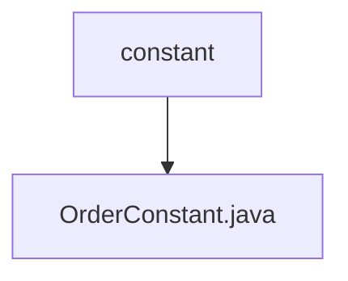

# 基础信息

|      |      |
|------|------|
| 编码语言 | .java |
| 代码路径 | boat-house-backend/src/product-service/api/src/main/java/com/idcf/boathouse/product/models/constant |
| 包名 | boat-house-backend.src.product-service.api.src.main.java.com.idcf.boathouse.product.models.constant |
| 概述说明 | OrderConstant类定义订单状态映射及状态描述功能。 |

# 说明

OrderConstant类用于定义订单状态的映射关系，并提供一个方法用于获取订单状态的描述。该类的主要功能是将订单状态与其对应的描述信息关联起来，便于在系统中统一管理和使用订单状态信息。通过此类，可以方便地查询和获取订单状态的详细描述，确保订单状态在系统中的一致性和可读性。

### 包内部结构视图

这段流程图展示了`boat-house-backend`项目中`product-service`模块的路径层级关系。`constant`文件夹是路径的最后一个层级，而`OrderConstant.java`文件位于`constant`文件夹内。流程图清晰地表示了`constant`文件夹与`OrderConstant.java`文件之间的从属关系，帮助开发者快速理解项目结构。

# 文件列表 File List

| 名称   | 类型  | 说明 |
|-------|------|-------------|
| [OrderConstant.java](OrderConstant.md) | file | OrderConstant类定义订单状态映射及状态描述功能。 |

