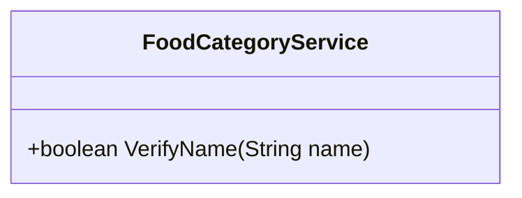
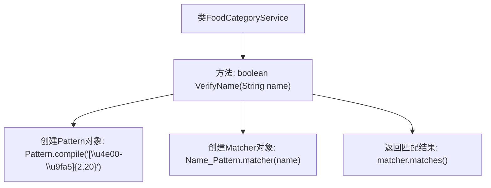

# 基础信息

|      |      |
|------|------|
| 编码语言 | .java |
| 代码路径 | boat-house-backend/src/product-service/api/src/main/java/com/idcf/boathouse/product/services/FoodCategoryService.java |
| 包名 | com.idcf.boathouse.product.services |
| 依赖项 | ['java.util.regex.Matcher', 'java.util.regex.Pattern'] |
| 概述说明 | FoodCategoryService类VerifyName方法验证名称是否为2-20个中文字符。 |

# 说明

FoodCategoryService类中包含一个名为VerifyName的方法，该方法用于验证输入的名称是否符合特定要求。具体来说，VerifyName方法会检查名称是否由2到20个中文字符组成，确保名称长度和字符类型符合规定。该方法主要用于处理与食品分类相关的名称验证，以确保数据的准确性和一致性。

# 类列表 Class Summary

| 名称   | 类型  | 说明 |
|-------|------|-------------|
| FoodCategoryService | class | FoodCategoryService类包含VerifyName方法，用于验证名称是否为2到20个中文字符。 |

## 类 FoodCategoryService

|      |      |
|------|------|
| 访问范围 | public |
| 类型 | class |
| 名称 | FoodCategoryService |
| 说明 | FoodCategoryService类包含VerifyName方法，用于验证名称是否为2到20个中文字符。 |

### UML类图

这段代码定义了一个名为 `FoodCategoryService` 的类，其中包含一个公有方法 `VerifyName`。该方法接收一个 `String` 类型的参数 `name`，并使用正则表达式验证该名称是否由2到20个中文字符组成。如果匹配成功，则返回 `true`，否则返回 `false`。该类的功能主要是对食品类别的名称进行验证，确保其符合指定的中文命名规则。

### 内部方法调用关系图

这段代码定义了一个名为`FoodCategoryService`的类，其中包含一个`VerifyName`方法。该方法用于验证传入的字符串`name`是否符合中文名称的格式要求，即长度为2到20个中文字符。方法内部通过正则表达式创建`Pattern`对象，并使用`Matcher`对象进行匹配，最终返回匹配结果。流程图清晰地展示了方法的执行流程，从创建`Pattern`对象到返回匹配结果的整个过程。

### 字段列表 Field List

| 名称  | 类型  | 说明 |
|-------|-------|------|

### 方法列表 Method List

| 名称  | 类型  | 说明 |
|-------|-------|------|
| VerifyName | boolean | 该方法验证中文姓名，要求2到20个汉字。 |

