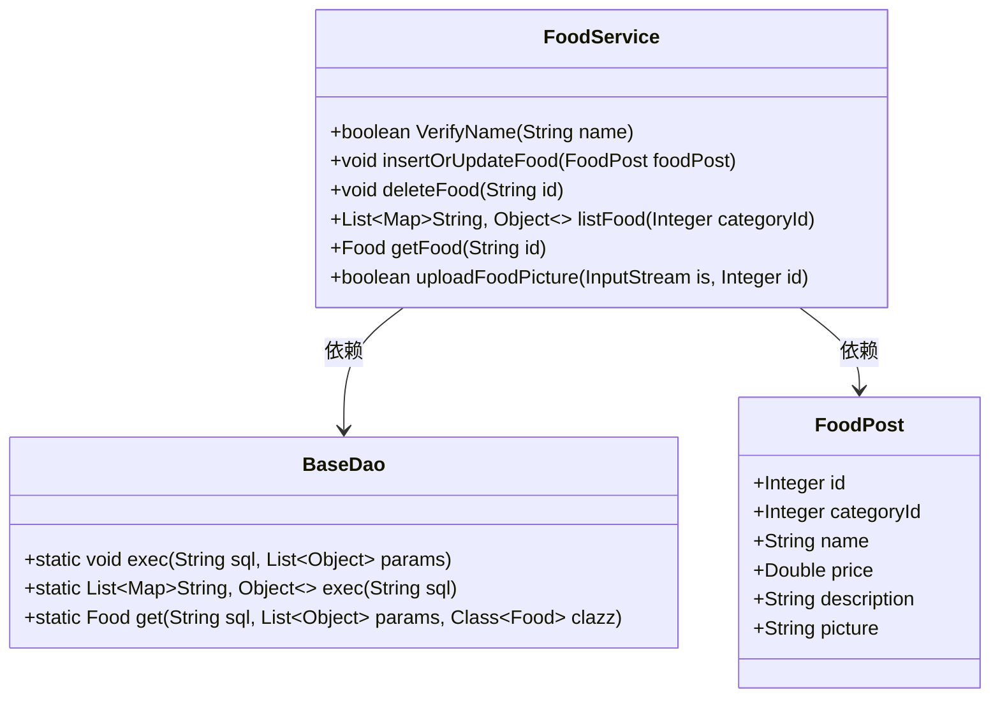
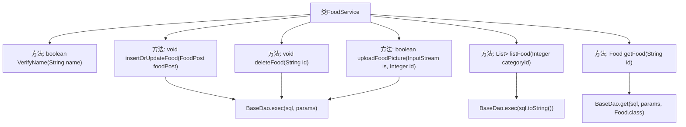

# 基础信息

|      |      |
|------|------|
| 编码语言 | .java |
| 代码路径 | boat-house-backend/src/product-service/api/src/main/java/com/idcf/boathouse/product/services/FoodService.java |
| 包名 | com.idcf.boathouse.product.services |
| 依赖项 | ['com.idcf.boathouse.product.dao.BaseDao', 'com.idcf.boathouse.product.models.Food', 'com.idcf.boathouse.product.models.FoodPost', 'org.springframework.stereotype.Service', 'java.io.InputStream', 'java.util.ArrayList', 'java.util.List', 'java.util.Map', 'java.util.regex.Matcher', 'java.util.regex.Pattern'] |
| 概述说明 | FoodService类实现食品名称验证、增删改查和图片上传功能。 |

# 说明

FoodService类是一个用于管理食品相关功能的类，提供了多项核心操作。它能够验证食品名称的有效性，确保名称符合特定规则或标准。此外，该类支持对食品信息的增删改查操作，方便用户添加、删除、修改和查询食品数据。同时，FoodService类还具备图片上传功能，允许用户为食品上传相关图片，以便更好地展示和管理食品信息。这些功能共同构成了一个全面的食品管理解决方案。

# 类列表 Class Summary

| 名称   | 类型  | 说明 |
|-------|------|-------------|
| FoodService | class | FoodService类提供食品名称验证、增删改查及图片上传功能。 |

## 类 FoodService

|      |      |
|------|------|
| 访问范围 | @Service;public |
| 类型 | class |
| 名称 | FoodService |
| 说明 | FoodService类提供食品名称验证、增删改查及图片上传功能。 |

### UML类图

这段代码定义了一个`FoodService`类，该类提供了多种与食品相关的服务，包括验证食品名称、插入或更新食品信息、删除食品、列出食品、获取食品信息以及上传食品图片。`FoodService`类依赖于`BaseDao`类来执行数据库操作，并且使用`FoodPost`类作为数据传递对象。`BaseDao`类提供了静态方法来执行SQL查询和更新操作。

### 内部方法调用关系图

该流程图展示了`FoodService`类中各个方法的调用关系。`FoodService`类包含多个方法，如验证名称、插入或更新食品信息、删除食品、列出食品、获取食品信息以及上传食品图片等。每个方法最终都会调用`BaseDao`类中的`exec`或`get`方法，执行相应的数据库操作。通过该流程图，可以清晰地看到每个方法的执行路径及其与`BaseDao`类的交互关系。

### 字段列表 Field List

| 名称  | 类型  | 说明 |
|-------|-------|------|

### 方法列表 Method List

| 名称  | 类型  | 说明 |
|-------|-------|------|
| uploadFoodPicture | boolean | 更新食品图片的数据库操作方法。 |
| VerifyName | boolean | 该方法用于验证姓名是否为2到20个中文字符。 |
| deleteFood | void | 删除指定ID的食品记录。 |
| getFood | Food | 通过SQL查询根据ID获取Food对象，返回查询结果。 |
| listFood | List<Map<String, Object>> | 根据类别ID查询食物列表，返回数据库执行结果。 |
| insertOrUpdateFood | void | 插入或更新食物信息，包含分类、名称、价格、描述和图片。 |

