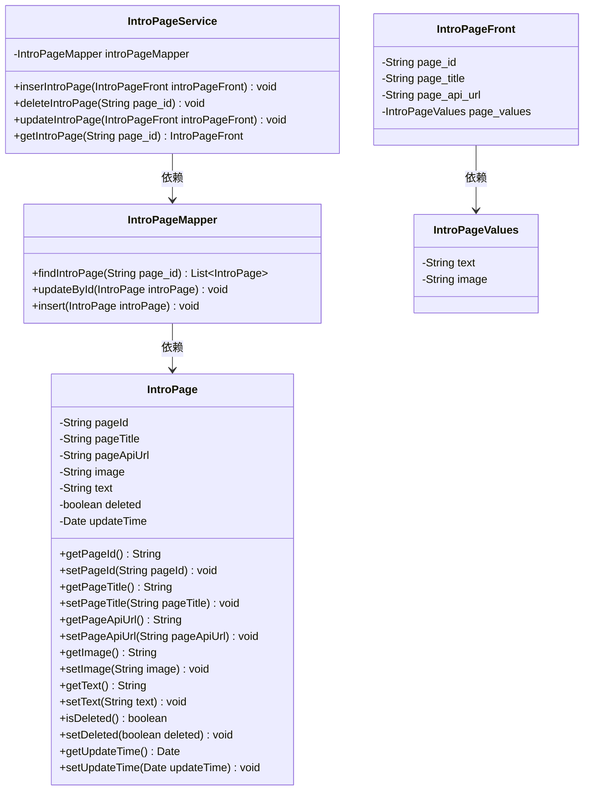
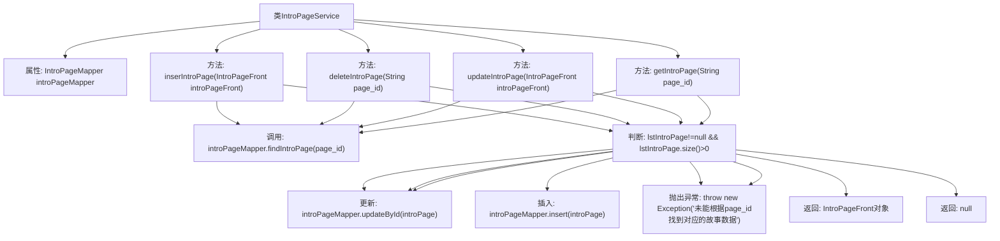

# 基础信息

|      |      |
|------|------|
| 编码语言 | .java |
| 代码路径 | boat-house-backend/src/product-service/api/src/main/java/com/idcf/boathouse/product/services/IntroPageService.java |
| 包名 | com.idcf.boathouse.product.services |
| 依赖项 | ['com.idcf.boathouse.product.mapper.IntroPageMapper', 'com.idcf.boathouse.product.models.IntroPage', 'com.idcf.boathouse.product.models.IntroPageFront', 'com.idcf.boathouse.product.models.IntroPageValues', 'org.springframework.beans.factory.annotation.Autowired', 'org.springframework.stereotype.Service', 'java.util.Date', 'java.util.List'] |
| 概述说明 | IntroPageService类管理船坞故事的增删改查操作。 |

# 说明

IntroPageService类是一个用于管理船坞故事数据的服务类，提供了插入、更新、删除和获取船坞故事数据的功能。该类通过这些操作实现对船坞故事数据的全面管理，确保数据的完整性和一致性。

# 类列表 Class Summary

| 名称   | 类型  | 说明 |
|-------|------|-------------|
| IntroPageService | class | IntroPageService类提供插入、更新、删除和获取船坞故事数据的功能。 |

## 类 IntroPageService

|      |      |
|------|------|
| 访问范围 | @Service;public |
| 类型 | class |
| 名称 | IntroPageService |
| 说明 | IntroPageService类提供插入、更新、删除和获取船坞故事数据的功能。 |

### UML类图

**描述：**
`IntroPageService` 是一个服务类，负责处理与 `IntroPage` 相关的业务逻辑，包括插入、更新、删除和获取 `IntroPage` 数据。它依赖于 `IntroPageMapper` 来进行数据库操作。`IntroPage` 类表示数据库中的实体，包含页面ID、标题、API URL、图片、文本等属性。`IntroPageFront` 和 `IntroPageValues` 类用于前端数据的传递和展示。整个类图展示了服务层与数据访问层之间的依赖关系，以及数据实体的结构。

### 内部方法调用关系图

这段代码定义了一个`IntroPageService`类，用于管理船坞故事的插入、更新、删除和查询操作。类中通过`IntroPageMapper`与数据库交互，根据传入的`IntroPageFront`对象或`page_id`执行相应的操作。如果数据存在，则更新或删除；如果不存在，则插入或抛出异常。查询操作返回`IntroPageFront`对象或`null`。流程图展示了各个方法的调用关系和判断逻辑。

### 字段列表 Field List

| 名称  | 类型  | 说明 |
|-------|-------|------|
| introPageMapper | IntroPageMapper | 自动注入IntroPageMapper实例。 |

### 方法列表 Method List

| 名称  | 类型  | 说明 |
|-------|-------|------|
| deleteIntroPage | void | 根据page_id删除介绍页，若未找到则抛出异常。 |
| getIntroPage | IntroPageFront | 通过page_id获取IntroPageFront对象，包含页面ID、标题、API URL及内容。 |
| inserIntroPage | void | 插入或更新介绍页信息，包括标题、API链接、图片和文本。 |
| updateIntroPage | void | 更新介绍页信息，若找到对应数据则修改并保存，否则抛出异常。 |

