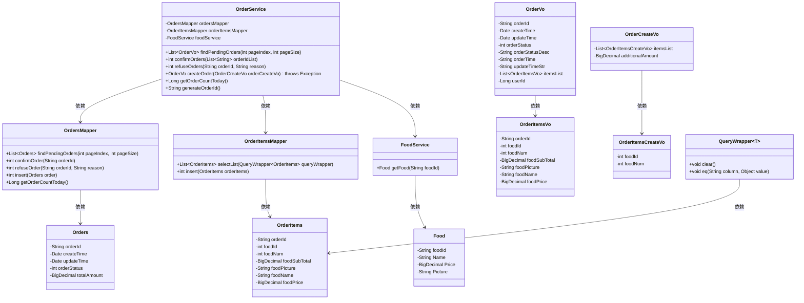
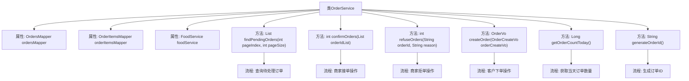

# 基础信息

|      |      |
|------|------|
| 编码语言 | .java |
| 代码路径 | boat-house-backend/src/product-service/api/src/main/java/com/idcf/boathouse/product/services/OrderService.java |
| 包名 | com.idcf.boathouse.product.services |
| 依赖项 | ['com.baomidou.mybatisplus.core.conditions.query.QueryWrapper', 'com.idcf.boathouse.product.enums.OrderStatusEnum', 'com.idcf.boathouse.product.mapper.OrderItemsMapper', 'com.idcf.boathouse.product.mapper.OrdersMapper', 'com.idcf.boathouse.product.models.Food', 'com.idcf.boathouse.product.models.OrderItems', 'com.idcf.boathouse.product.models.Orders', 'com.idcf.boathouse.product.models.constant.OrderConstant', 'com.idcf.boathouse.product.untils.DateUtils', 'com.idcf.boathouse.product.vo.OrderCreateVo', 'com.idcf.boathouse.product.vo.OrderItemsCreateVo', 'com.idcf.boathouse.product.vo.OrderItemsVo', 'com.idcf.boathouse.product.vo.OrderVo', 'org.springframework.beans.BeanUtils', 'org.springframework.beans.factory.annotation.Autowired', 'org.springframework.stereotype.Service', 'org.springframework.transaction.annotation.Transactional', 'java.math.BigDecimal', 'java.text.SimpleDateFormat', 'java.util.ArrayList', 'java.util.Date', 'java.util.List'] |
| 概述说明 | 订单服务类支持查询、接单、拒单、下单及生成订单号。 |

# 说明

订单服务类具备多种功能，包括查询订单信息、接收订单、拒绝订单、创建新订单以及生成唯一的订单号。这些功能共同构成了一个完整的订单处理系统，确保用户能够高效地管理和操作订单流程。

# 类列表 Class Summary

| 名称   | 类型  | 说明 |
|-------|------|-------------|
| OrderService | class | 订单服务类提供查询、接单、拒单、下单及生成订单号功能。 |

## 类 OrderService

|      |      |
|------|------|
| 访问范围 | @Service;public |
| 类型 | class |
| 名称 | OrderService |
| 说明 | 订单服务类提供查询、接单、拒单、下单及生成订单号功能。 |

### UML类图

### 描述
`OrderService` 类负责处理订单相关的业务逻辑，包括查询待处理订单、商家接单、商家拒单、客户下单等操作。它依赖于 `OrdersMapper` 和 `OrderItemsMapper` 来访问数据库中的订单和订单项数据，并依赖于 `FoodService` 来获取菜品信息。`OrderVo` 和 `OrderItemsVo` 是用于展示订单和订单项信息的视图对象，`OrderCreateVo` 和 `OrderItemsCreateVo` 是用于创建订单的视图对象。`QueryWrapper` 是一个用于构建查询条件的工具类。

### 内部方法调用关系图

这段代码定义了一个`OrderService`类，用于处理订单相关的业务逻辑。类中包含多个方法，分别用于查询待处理订单、商家接单、商家拒单、客户下单、获取当天订单数量以及生成订单ID。每个方法通过调用不同的Mapper或Service来完成具体的业务操作。代码通过`@Autowired`注解注入所需的Mapper和Service，确保依赖关系正确。整体流程清晰，涵盖了订单处理的主要场景。

### 字段列表 Field List

| 名称  | 类型  | 说明 |
|-------|-------|------|
| ordersMapper | OrdersMapper | 自动注入OrdersMapper对象。 |
| foodService | FoodService | 自动注入FoodService实例。 |
| orderItemsMapper | OrderItemsMapper | 自动注入订单项映射器实例。 |

### 方法列表 Method List

| 名称  | 类型  | 说明 |
|-------|-------|------|
| refuseOrders | int | 方法拒绝订单，返回处理结果。 |
| createOrder | OrderVo | 创建订单并计算总金额，返回订单信息。 |
| getOrderCountToday | Long | 获取今日订单数量的方法。 |
| confirmOrders | int | 确认订单列表并返回状态码。 |
| findPendingOrders | List<OrderVo> | 查询待处理订单，包含订单项及状态描述，返回格式化订单列表。 |
| generateOrderId | String | 生成订单ID方法：日期加8位序号。 |

