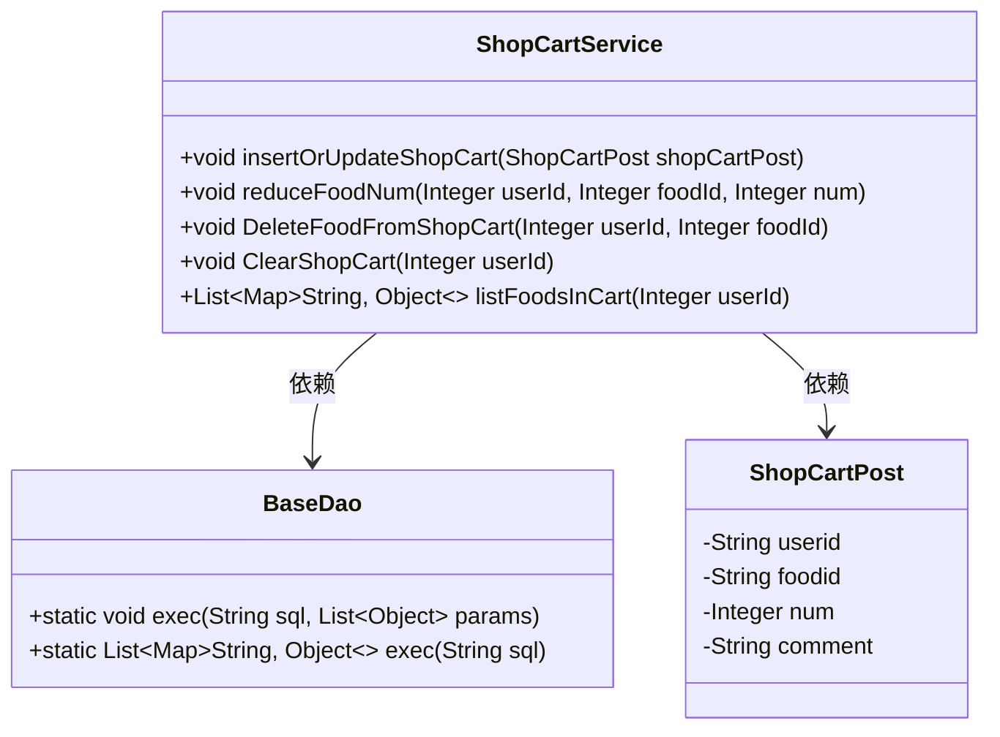
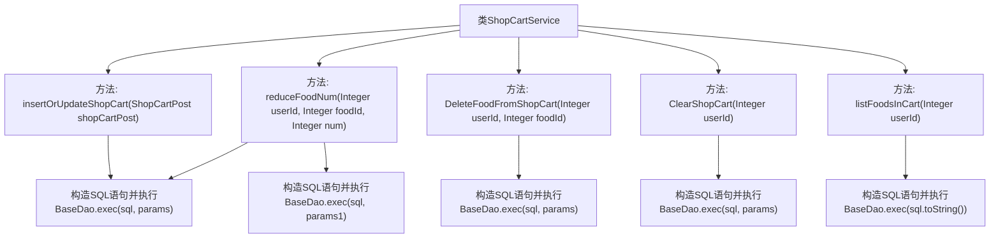

# 基础信息

|      |      |
|------|------|
| 编码语言 | .java |
| 代码路径 | boat-house-backend/src/product-service/api/src/main/java/com/idcf/boathouse/product/services/ShopCartService.java |
| 包名 | com.idcf.boathouse.product.services |
| 依赖项 | ['com.idcf.boathouse.product.dao.BaseDao', 'com.idcf.boathouse.product.models.ShopCartPost', 'org.springframework.stereotype.Service', 'java.util.ArrayList', 'java.util.List', 'java.util.Map'] |
| 概述说明 | ShopCartService提供购物车的插入、更新、减少、删除、清空及查询功能。 |

# 说明

ShopCartService是一个用于管理购物车的服务，提供多种操作功能。它支持插入和更新购物车中的商品，允许用户减少商品数量，删除特定商品，以及清空整个购物车。此外，该服务还提供查询功能，使用户能够查看购物车中的当前内容。通过这些功能，ShopCartService帮助用户高效地管理和维护其购物车状态。

# 类列表 Class Summary

| 名称   | 类型  | 说明 |
|-------|------|-------------|
| ShopCartService | class | ShopCartService提供购物车操作，包括插入更新、减少数量、删除、清空及查询功能。 |

## 类 ShopCartService

|      |      |
|------|------|
| 访问范围 | @Service;public |
| 类型 | class |
| 名称 | ShopCartService |
| 说明 | ShopCartService提供购物车操作，包括插入更新、减少数量、删除、清空及查询功能。 |

### UML类图

**描述：**  
`ShopCartService` 类提供了购物车相关的服务，包括插入或更新购物车、减少商品数量、删除商品、清空购物车以及列出购物车中的商品。`ShopCartPost` 类用于封装购物车提交的数据，包含用户ID、食品ID、数量和评论等字段。`BaseDao` 类负责执行SQL语句，处理数据库操作。`ShopCartService` 依赖于 `BaseDao` 来执行数据库操作，并通过 `ShopCartPost` 来传递购物车数据。

### 内部方法调用关系图

这段代码定义了一个`ShopCartService`类，包含了多个方法用于操作购物车。`insertOrUpdateShopCart`方法用于插入或更新购物车中的商品信息；`reduceFoodNum`方法用于减少购物车中某商品的数量，并在数量小于等于0时删除该商品；`DeleteFoodFromShopCart`方法用于从购物车中删除指定商品；`ClearShopCart`方法用于清空指定用户的购物车；`listFoodsInCart`方法用于列出购物车中的商品信息。每个方法都通过构造SQL语句并调用`BaseDao.exec`方法来执行数据库操作。

### 字段列表 Field List

| 名称  | 类型  | 说明 |
|-------|-------|------|

### 方法列表 Method List

| 名称  | 类型  | 说明 |
|-------|-------|------|
| insertOrUpdateShopCart | void | 插入或更新购物车数据，支持重复时数量累加。 |
| DeleteFoodFromShopCart | void | 删除用户购物车中指定食品的方法。 |
| listFoodsInCart | List<Map<String, Object>> | 该方法根据用户ID查询购物车中的食品信息。 |
| reduceFoodNum | void | 方法减少购物车中食物数量，若数量小于等于0则删除该食物。 |
| ClearShopCart | void | 清除用户购物车的Java方法，通过SQL删除指定用户的购物车数据。 |

