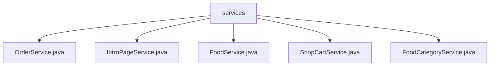

# 基础信息

|      |      |
|------|------|
| 编码语言 | .java |
| 代码路径 | boat-house-backend/src/product-service/api/src/main/java/com/idcf/boathouse/product/services |
| 包名 | boat-house-backend.src.product-service.api.src.main.java.com.idcf.boathouse.product.services |
| 概述说明 | 订单服务类管理订单流程，IntroPageService管理船坞故事数据，FoodService管理食品信息，ShopCartService管理购物车，FoodCategoryService验证食品分类名称。 |

# 说明

订单服务类提供查询、接收、拒绝、创建订单及生成唯一订单号功能，构成完整订单处理系统。IntroPageService类管理船坞故事数据，支持插入、更新、删除和获取操作，确保数据完整性和一致性。FoodService类管理食品相关功能，包括验证食品名称、增删改查食品数据及图片上传，提供全面食品管理解决方案。ShopCartService管理购物车，支持插入、更新、减少、删除商品及清空购物车，并提供查询功能，帮助用户高效维护购物车状态。FoodCategoryService类中的VerifyName方法验证食品分类名称，确保名称由2到20个中文字符组成，保证数据准确性和一致性。

### 包内部结构视图

该流程图展示了`services`目录下的五个Java服务类文件。`services`作为根节点，包含了`OrderService.java`、`IntroPageService.java`、`FoodService.java`、`ShopCartService.java`和`FoodCategoryService.java`五个子节点，清晰地反映了这些文件在项目中的层级关系。

# 文件列表 File List

| 名称   | 类型  | 说明 |
|-------|------|-------------|
| [FoodCategoryService.java](FoodCategoryService.md) | file | FoodCategoryService类VerifyName方法验证名称是否为2-20个中文字符。 |
| [ShopCartService.java](ShopCartService.md) | file | ShopCartService提供购物车的插入、更新、减少、删除、清空及查询功能。 |
| [FoodService.java](FoodService.md) | file | FoodService类实现食品名称验证、增删改查和图片上传功能。 |
| [IntroPageService.java](IntroPageService.md) | file | IntroPageService类管理船坞故事的增删改查操作。 |
| [OrderService.java](OrderService.md) | file | 订单服务类支持查询、接单、拒单、下单及生成订单号。 |

