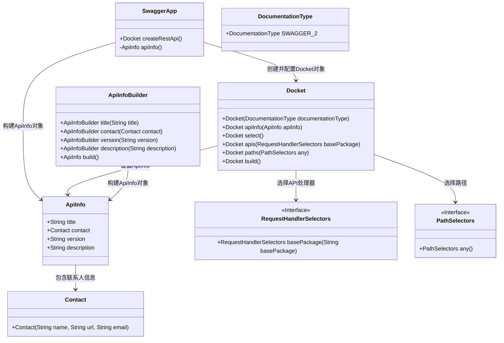
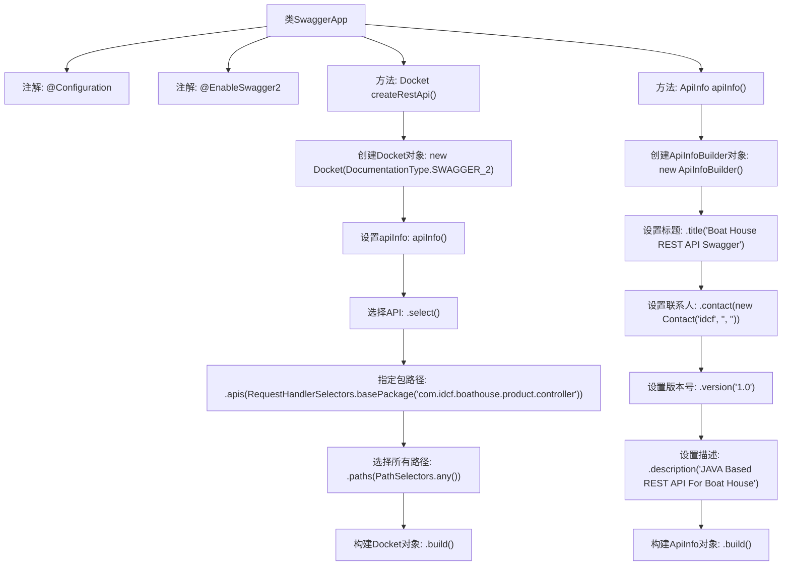

# 基础信息

|      |      |
|------|------|
| 编码语言 | .java |
| 代码路径 | boat-house-backend/src/product-service/api/src/main/java/com/idcf/boathouse/product/swagger/SwaggerApp.java |
| 包名 | com.idcf.boathouse.product.swagger |
| 依赖项 | ['springfox.documentation.service.Contact', 'org.springframework.context.annotation.Bean', 'org.springframework.context.annotation.Configuration', 'springfox.documentation.builders.ApiInfoBuilder', 'springfox.documentation.builders.PathSelectors', 'springfox.documentation.builders.RequestHandlerSelectors', 'springfox.documentation.service.ApiInfo', 'springfox.documentation.spi.DocumentationType', 'springfox.documentation.spring.web.plugins.Docket', 'springfox.documentation.swagger2.annotations.EnableSwagger2'] |
| 概述说明 | Swagger配置类启用Swagger2，设置API信息并指定扫描包路径。 |

# 说明

Swagger配置类用于启用Swagger2框架，配置API的基本信息，如标题、描述、版本等，并指定需要扫描的包路径以自动生成API文档。通过该配置，开发者可以方便地管理和展示API接口，提升开发效率和文档的可读性。

# 类列表 Class Summary

| 名称   | 类型  | 说明 |
|-------|------|-------------|
| SwaggerApp | class | Swagger配置类，启用Swagger2，定义API信息和扫描包路径。 |

## 类 SwaggerApp

|      |      |
|------|------|
| 访问范围 | @Configuration;@EnableSwagger2;public |
| 类型 | class |
| 名称 | SwaggerApp |
| 说明 | Swagger配置类，启用Swagger2，定义API信息和扫描包路径。 |

### UML类图

这段代码是一个Spring Boot应用程序中用于配置Swagger的类。`SwaggerApp`类通过`@Configuration`和`@EnableSwagger2`注解启用了Swagger，并定义了一个`Docket` Bean来配置Swagger的API文档生成。`createRestApi`方法创建并配置了一个`Docket`对象，指定了API的基本信息、包路径和路径选择器。`apiInfo`方法构建了API文档的详细信息，包括标题、联系人、版本号和描述。通过这些配置，Swagger可以自动生成API文档，便于开发者查看和测试API。

### 内部方法调用关系图

这段代码定义了一个名为`SwaggerApp`的配置类，用于配置Swagger API文档生成。`createRestApi`方法创建并返回一个`Docket`对象，该对象指定了API文档的生成规则，包括API信息的设置、包路径的选择等。`apiInfo`方法则用于构建API文档的详细信息，包括标题、联系人、版本号和描述。通过这两个方法，代码实现了对Swagger API文档的详细配置和生成。

### 字段列表 Field List

| 名称  | 类型  | 说明 |
|-------|-------|------|

### 方法列表 Method List

| 名称  | 类型  | 说明 |
|-------|-------|------|
| createRestApi | Docket | 创建Swagger API文档，扫描指定包路径的控制器。 |
| apiInfo | ApiInfo | Boat House REST API Swagger，版本1.0，由idcf创建，基于JAVA。 |

