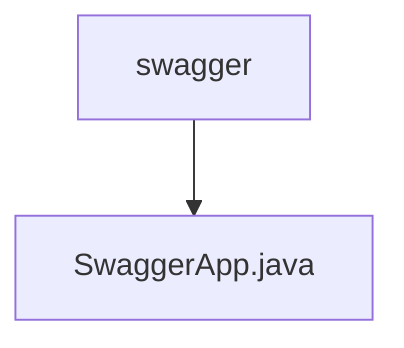

# 基础信息

|      |      |
|------|------|
| 编码语言 | .java |
| 代码路径 | boat-house-backend/src/product-service/api/src/main/java/com/idcf/boathouse/product/swagger |
| 包名 | boat-house-backend.src.product-service.api.src.main.java.com.idcf.boathouse.product.swagger |
| 概述说明 | Swagger配置类启用Swagger2，设置API信息并指定扫描包路径。 |

# 说明

Swagger配置类用于启用Swagger2框架，配置API的基本信息，如标题、描述、版本等，并指定需要扫描的包路径以自动生成API文档。通过该配置，开发者可以方便地管理和展示API接口，提升开发效率和文档的可读性。

### 包内部结构视图

该流程图展示了路径的层级关系，`swagger`文件夹下包含一个名为`SwaggerApp.java`的文件。路径结构简洁明了，符合给定的路径信息，且节点名称仅使用了路径的最后一级元素。

# 文件列表 File List

| 名称   | 类型  | 说明 |
|-------|------|-------------|
| [SwaggerApp.java](SwaggerApp.md) | file | Swagger配置类启用Swagger2，设置API信息并指定扫描包路径。 |

