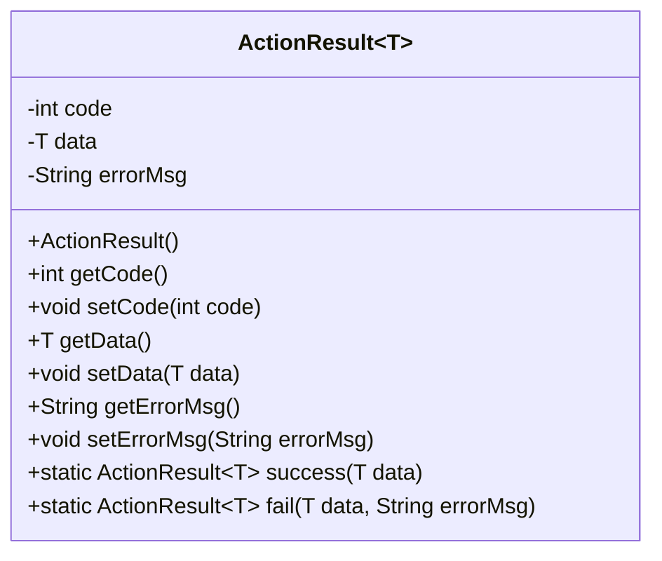
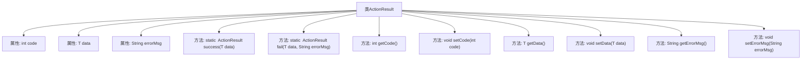

# 基础信息

|      |      |
|------|------|
| 编码语言 | .java |
| 代码路径 | boat-house-backend/src/product-service/api/src/main/java/com/idcf/boathouse/product/untils/ActionResult.java |
| 包名 | com.idcf.boathouse.product.untils |
| 依赖项 | ['com.idcf.boathouse.product.enums.ResponseEnum', 'io.swagger.annotations.ApiModel', 'io.swagger.annotations.ApiModelProperty', 'java.io.Serializable'] |
| 概述说明 | ActionResult类封装操作结果，含状态码、数据和错误信息，支持成功和失败状态。 |

# 说明

ActionResult类是一个用于封装操作结果的工具，其主要功能是包含操作的状态码、相关数据以及错误信息。该类支持两种基本状态：成功和失败。通过使用ActionResult类，开发者可以更方便地管理和传递操作结果，确保状态码、数据和错误信息能够被统一处理。这种设计有助于提高代码的可读性和维护性，使操作结果的传递更加清晰和系统化。

# 类列表 Class Summary

| 名称   | 类型  | 说明 |
|-------|------|-------------|
| ActionResult | class | ActionResult类用于封装操作结果，包含状态码、数据和错误信息，支持成功和失败两种状态。 |

## 类 ActionResult

|      |      |
|------|------|
| 访问范围 | @ApiModel;//@Data;public |
| 类型 | class |
| 名称 | ActionResult |
| 说明 | ActionResult类用于封装操作结果，包含状态码、数据和错误信息，支持成功和失败两种状态。 |

### UML类图

**描述：**  
`ActionResult` 是一个泛型类，用于封装操作结果。它包含三个私有成员：`code`（表示操作成功或失败的代码）、`data`（成功时返回的数据）和 `errorMsg`（失败时返回的错误信息）。类提供了两个静态方法 `success` 和 `fail`，分别用于创建成功和失败的操作结果对象。此外，类还提供了相应的 `getter` 和 `setter` 方法来访问和修改这些成员。

### 内部方法调用关系图

这段代码定义了一个泛型类 `ActionResult<T>`，用于封装操作结果。类中包含三个属性：`code` 表示操作结果的状态码，`data` 表示成功时的返回数据，`errorMsg` 表示失败时的错误信息。类提供了两个静态方法 `success` 和 `fail` 来分别创建成功和失败的操作结果对象，并提供了相应的 getter 和 setter 方法来访问和修改这些属性。

### 字段列表 Field List

| 名称  | 类型  | 说明 |
|-------|-------|------|
| errorMsg | String | 返回失败时查看errorMsg。 |
| data | T | 成功时返回的data数据。 |
| code | int | 返回码：0表示失败，1表示成功。 |

### 方法列表 Method List

| 名称  | 类型  | 说明 |
|-------|-------|------|
| getErrorMsg | String | 获取错误信息的公共方法。 |
| success | ActionResult<T> | 静态方法返回包含成功数据和响应码的ActionResult对象。 |
| setCode | void | 设置代码值为指定整数值。 |
| setErrorMsg | void | 设置错误信息的方法，将传入字符串赋值给类成员变量。 |
| getCode | int | 该方法返回整型变量code的值。 |
| getData | T | 方法getData返回类型为T的data值。 |
| setData | void | 设置数据方法，将输入数据赋值给当前对象的数据属性。 |
| fail | ActionResult<T> | 静态方法`fail`返回包含错误信息和数据的`ActionResult`对象。 |

