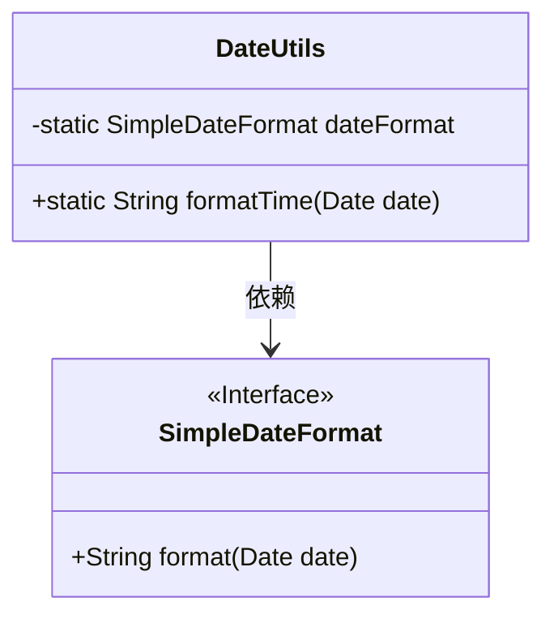
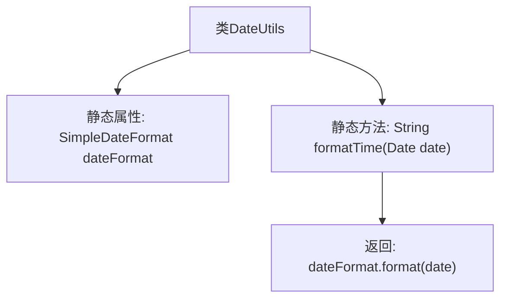

# 基础信息

|      |      |
|------|------|
| 编码语言 | .java |
| 代码路径 | boat-house-backend/src/product-service/api/src/main/java/com/idcf/boathouse/product/untils/DateUtils.java |
| 包名 | com.idcf.boathouse.product.untils |
| 依赖项 | ['java.text.SimpleDateFormat', 'java.util.Date'] |
| 概述说明 | DateUtils类通过SimpleDateFormat将日期时间格式化为指定样式。 |

# 说明

DateUtils类利用SimpleDateFormat工具将日期时间格式化为用户指定的样式。该类通过SimpleDateFormat提供的功能，能够灵活地将日期和时间转换为不同的字符串表现形式，满足各种格式需求。此方法在处理日期时间数据时，确保了输出的统一性和可读性，适用于需要精确控制日期时间格式的场景。

# 类列表 Class Summary

| 名称   | 类型  | 说明 |
|-------|------|-------------|
| DateUtils | class | DateUtils类使用SimpleDateFormat格式化日期时间为指定格式。 |

## 类 DateUtils

|      |      |
|------|------|
| 访问范围 | public final |
| 类型 | class |
| 名称 | DateUtils |
| 说明 | DateUtils类使用SimpleDateFormat格式化日期时间为指定格式。 |

### UML类图

这段代码定义了一个名为 `DateUtils` 的工具类，其中包含一个静态的 `SimpleDateFormat` 对象 `dateFormat`，用于格式化日期。`DateUtils` 类提供了一个静态方法 `formatTime`，该方法接收一个 `Date` 对象并返回格式化后的字符串。`SimpleDateFormat` 是一个接口，`DateUtils` 类依赖于它来实现日期的格式化功能。

### 内部方法调用关系图

这段代码定义了一个名为 `DateUtils` 的工具类，其中包含一个静态的 `SimpleDateFormat` 对象 `dateFormat`，用于格式化日期时间。`formatTime` 方法接收一个 `Date` 对象，并返回格式化后的字符串。流程图展示了类的结构及其内部方法调用关系，清晰展示了从类到方法再到返回值的流程。

### 字段列表 Field List

| 名称  | 类型  | 说明 |
|-------|-------|------|
| dateFormat = new SimpleDateFormat("yyyy-MM-dd HH:mm:ss") | SimpleDateFormat | 定义私有静态日期格式化对象，格式为"年-月-日 时:分:秒"。 |

### 方法列表 Method List

| 名称  | 类型  | 说明 |
|-------|-------|------|
| formatTime | String | 格式化日期为字符串。 |

