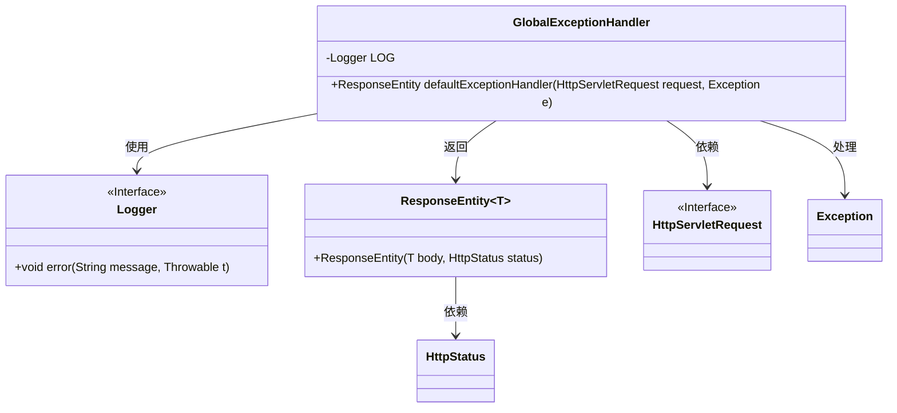
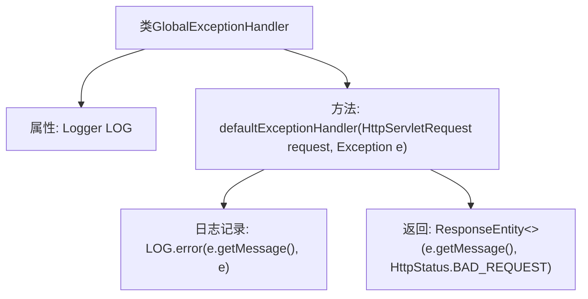

# 基础信息

|      |      |
|------|------|
| 编码语言 | .java |
| 代码路径 | boat-house-backend/src/product-service/api/src/main/java/com/idcf/boathouse/product/untils/GlobalExceptionHandler.java |
| 包名 | com.idcf.boathouse.product.untils |
| 依赖项 | ['org.slf4j.Logger', 'org.slf4j.LoggerFactory', 'org.springframework.http.HttpStatus', 'org.springframework.http.ResponseEntity', 'org.springframework.web.bind.annotation.ControllerAdvice', 'org.springframework.web.bind.annotation.ExceptionHandler', 'org.springframework.web.bind.annotation.ResponseBody', 'javax.servlet.http.HttpServletRequest'] |
| 概述说明 | 全局异常处理器捕获所有异常并返回错误信息。 |

# 说明

全局异常处理器是一种用于捕获系统中所有异常并返回相应错误信息的机制。它确保在应用程序的任何部分发生异常时，能够统一处理并提供一致的错误响应。通过全局异常处理器，开发者可以避免在每个方法或模块中重复编写异常处理代码，从而提高代码的可维护性和可读性。该处理器通常会在应用程序的顶层进行配置，以便在异常发生时，能够捕获并记录异常信息，同时向用户或调用方返回友好的错误提示，确保系统的稳定性和用户体验。

# 类列表 Class Summary

| 名称   | 类型  | 说明 |
|-------|------|-------------|
| GlobalExceptionHandler | class | 全局异常处理器，捕获所有异常并返回错误信息。 |

## 类 GlobalExceptionHandler

|      |      |
|------|------|
| 访问范围 | @ControllerAdvice;public |
| 类型 | class |
| 名称 | GlobalExceptionHandler |
| 说明 | 全局异常处理器，捕获所有异常并返回错误信息。 |

### UML类图

这段代码定义了一个全局异常处理类 `GlobalExceptionHandler`，用于捕获和处理应用程序中的异常。该类包含一个私有日志记录器 `LOG` 和一个公有方法 `defaultExceptionHandler`，该方法接收 `HttpServletRequest` 和 `Exception` 作为参数，并返回一个包含异常信息和 `BAD_REQUEST` 状态的 `ResponseEntity` 对象。通过 `@ControllerAdvice` 和 `@ExceptionHandler` 注解，该类能够全局处理所有未被捕获的异常，并记录错误日志。

### 内部方法调用关系图

这段代码定义了一个全局异常处理类 `GlobalExceptionHandler`，用于捕获和处理应用程序中的异常。类中包含一个 `Logger` 属性用于记录日志，以及一个 `defaultExceptionHandler` 方法，该方法在捕获到异常时会记录错误信息并返回一个包含错误消息和 `BAD_REQUEST` 状态码的 `ResponseEntity`。

### 字段列表 Field List

| 名称  | 类型  | 说明 |
|-------|-------|------|
| LOG = LoggerFactory.getLogger(GlobalExceptionHandler.class) | Logger | 定义全局异常处理类的日志记录器实例。 |

### 方法列表 Method List

| 名称  | 类型  | 说明 |
|-------|-------|------|
| defaultExceptionHandler | ResponseEntity | 处理异常并返回错误信息和400状态码。 |

