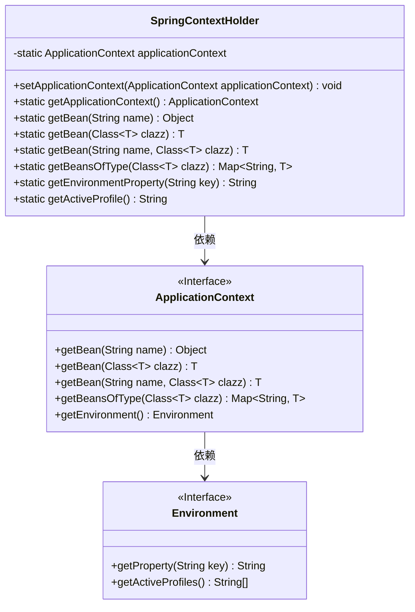
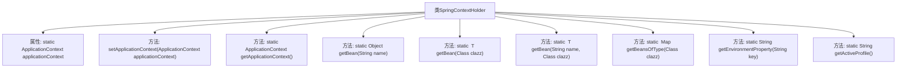

# 基础信息

|      |      |
|------|------|
| 编码语言 | .java |
| 代码路径 | boat-house-backend/src/product-service/api/src/main/java/com/idcf/boathouse/product/untils/SpringContextHolder.java |
| 包名 | com.idcf.boathouse.product.untils |
| 依赖项 | ['org.springframework.beans.BeansException', 'org.springframework.beans.factory.NoSuchBeanDefinitionException', 'org.springframework.context.ApplicationContext', 'org.springframework.context.ApplicationContextAware', 'org.springframework.stereotype.Component', 'java.util.Map'] |
| 概述说明 | SpringContextHolder类管理Spring应用上下文，提供Bean和配置获取方法。 |

# 说明

SpringContextHolder类是一个用于管理Spring应用上下文的工具类，其主要功能包括获取Spring容器中的Bean实例以及访问应用配置。通过该类，开发者可以方便地在应用中管理和操作Spring上下文，从而简化依赖注入和配置管理的流程。该类提供的方法使得获取Bean和配置信息变得更加便捷和高效，有助于提升应用的开发效率和可维护性。

# 类列表 Class Summary

| 名称   | 类型  | 说明 |
|-------|------|-------------|
| SpringContextHolder | class | SpringContextHolder类用于管理Spring应用上下文，提供获取Bean和配置的方法。 |

## 类 SpringContextHolder

|      |      |
|------|------|
| 访问范围 | @Component;public |
| 类型 | class |
| 名称 | SpringContextHolder |
| 说明 | SpringContextHolder类用于管理Spring应用上下文，提供获取Bean和配置的方法。 |

### UML类图

### 描述
`SpringContextHolder` 类是一个Spring框架的工具类，用于持有和管理 `ApplicationContext` 实例。它提供了多种静态方法来获取Spring容器中的Bean、配置文件属性以及当前激活的配置文件。`ApplicationContext` 是Spring的核心接口，用于访问应用程序上下文中的Bean和其他资源。`Environment` 接口用于访问应用程序的环境属性，如配置文件和系统属性。`SpringContextHolder` 依赖于 `ApplicationContext`，而 `ApplicationContext` 又依赖于 `Environment`。

### 内部方法调用关系图

这段代码定义了一个Spring上下文持有者类`SpringContextHolder`，它通过实现`ApplicationContextAware`接口来获取Spring的`ApplicationContext`。该类提供了多个静态方法，用于从Spring上下文中获取Bean、配置项值以及当前激活的配置文件。这些方法通过`getApplicationContext()`方法获取当前的`ApplicationContext`，然后调用相应的方法来执行具体的操作。

### 字段列表 Field List

| 名称  | 类型  | 说明 |
|-------|-------|------|
| applicationContext | ApplicationContext | 静态私有变量存储应用上下文实例。 |

### 方法列表 Method List

| 名称  | 类型  | 说明 |
|-------|-------|------|
| getApplicationContext | ApplicationContext | 获取应用上下文静态方法。 |
| getEnvironmentProperty | String | 该方法通过键获取环境属性值。 |
| getBean | T | 静态方法getBean通过类获取应用上下文中的Bean实例。 |
| setApplicationContext | void | 重写方法，将应用上下文设置为SpringContextHolder的静态变量。 |
| getBean | Object | 静态方法`getBean`通过名称获取Spring容器中的Bean，若不存在则返回null。 |
| getActiveProfile | String | 获取当前应用程序的激活配置文件名称。 |
| getBeansOfType | Map<String, T> | 静态方法获取指定类型的Bean实例映射。 |
| getBean | T | 静态方法getBean通过名称和类类型获取Spring应用上下文中的Bean实例。 |

