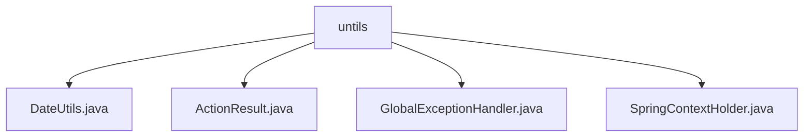

# 基础信息

|      |      |
|------|------|
| 编码语言 | .java |
| 代码路径 | boat-house-backend/src/product-service/api/src/main/java/com/idcf/boathouse/product/untils |
| 包名 | boat-house-backend.src.product-service.api.src.main.java.com.idcf.boathouse.product.untils |
| 概述说明 | DateUtils格式化日期，ActionResult封装操作结果，全局异常处理器统一处理异常，SpringContextHolder管理Spring上下文。 |

# 说明

DateUtils类使用SimpleDateFormat工具将日期时间格式化为指定样式，确保输出的统一性和可读性，适用于精确控制日期时间格式的场景。ActionResult类封装操作结果，包含状态码、数据和错误信息，支持成功和失败两种状态，便于管理和传递操作结果，提高代码可读性和维护性。全局异常处理器捕获系统异常并返回统一错误信息，避免重复编写异常处理代码，提升代码可维护性和系统稳定性。SpringContextHolder类管理Spring应用上下文，方便获取Bean实例和应用配置，简化依赖注入和配置管理，提升开发效率和可维护性。

### 包内部结构视图

该流程图展示了`untils`目录下的四个文件：`DateUtils.java`、`ActionResult.java`、`GlobalExceptionHandler.java`和`SpringContextHolder.java`。所有文件都直接隶属于`untils`目录，没有更深层次的嵌套结构。这种层级关系简洁明了，便于开发人员快速定位和管理相关工具类文件。

# 文件列表 File List

| 名称   | 类型  | 说明 |
|-------|------|-------------|
| [SpringContextHolder.java](SpringContextHolder.md) | file | SpringContextHolder类管理Spring应用上下文，提供Bean和配置获取方法。 |
| [GlobalExceptionHandler.java](GlobalExceptionHandler.md) | file | 全局异常处理器捕获所有异常并返回错误信息。 |
| [ActionResult.java](ActionResult.md) | file | ActionResult类封装操作结果，含状态码、数据和错误信息，支持成功和失败状态。 |
| [DateUtils.java](DateUtils.md) | file | DateUtils类通过SimpleDateFormat将日期时间格式化为指定样式。 |

