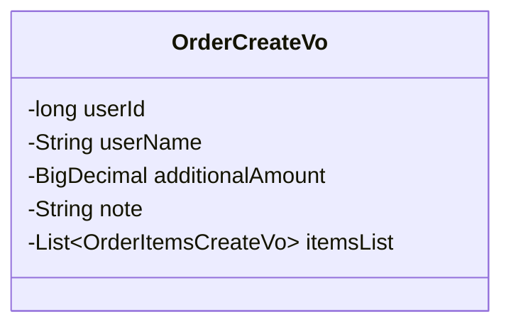
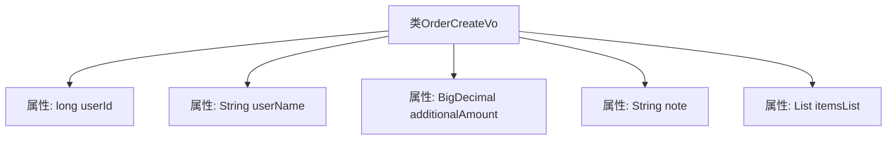

# 基础信息

|      |      |
|------|------|
| 编码语言 | .java |
| 代码路径 | boat-house-backend/src/product-service/api/src/main/java/com/idcf/boathouse/product/vo/OrderCreateVo.java |
| 包名 | com.idcf.boathouse.product.vo |
| 依赖项 | ['lombok.Data', 'java.math.BigDecimal', 'java.util.List'] |
| 概述说明 | 订单创建类含用户ID、用户名、附加金额、备注及订单项列表。 |

# 说明

订单创建类主要包含用户ID、用户名、附加金额、备注以及订单项列表。用户ID用于唯一标识用户，用户名提供用户的基本信息，附加金额表示订单中除商品外的额外费用，备注用于记录订单的特殊要求或说明，订单项列表则详细列出所有购买的商品或服务。这些信息共同构成了订单的基本结构，确保订单的完整性和可追溯性。

# 类列表 Class Summary

| 名称   | 类型  | 说明 |
|-------|------|-------------|
| OrderCreateVo | class | 订单创建类包含用户ID、用户名、附加金额、备注及订单项列表。 |

## 类 OrderCreateVo

|      |      |
|------|------|
| 访问范围 | @Data;public |
| 类型 | class |
| 名称 | OrderCreateVo |
| 说明 | 订单创建类包含用户ID、用户名、附加金额、备注及订单项列表。 |

### UML类图

这段代码定义了一个名为 `OrderCreateVo` 的类，用于表示订单创建时的视图对象。类中包含多个私有成员变量，包括 `userId`（用户ID）、`userName`（用户名）、`additionalAmount`（附加金额）、`note`（备注）以及 `itemsList`（订单项列表）。这些成员变量分别用于存储订单相关的信息，其中 `itemsList` 是一个泛型列表，存储了 `OrderItemsCreateVo` 类型的对象。

### 内部方法调用关系图

这段代码定义了一个名为 `OrderCreateVo` 的类，用于表示订单创建时的数据视图对象。该类包含五个属性：`userId`（用户ID，类型为 `long`）、`userName`（用户名，类型为 `String`）、`additionalAmount`（附加金额，类型为 `BigDecimal`）、`note`（备注，类型为 `String`）和 `itemsList`（订单项列表，类型为 `List<OrderItemsCreateVo>`）。这些属性分别用于存储订单创建时所需的用户信息、附加金额、备注以及订单项列表。

### 字段列表 Field List

| 名称  | 类型  | 说明 |
|-------|-------|------|
| note | String | 定义了一个私有字符串变量note。 |
| userName | String | 定义私有字符串变量userName。 |
| additionalAmount | BigDecimal | 声明一个名为additionalAmount的BigDecimal类型私有变量。 |
| userId | long | 定义了一个长整型私有变量userId。 |
| itemsList | List<OrderItemsCreateVo> | 私有订单项列表变量。 |

### 方法列表 Method List

| 名称  | 类型  | 说明 |
|-------|-------|------|

