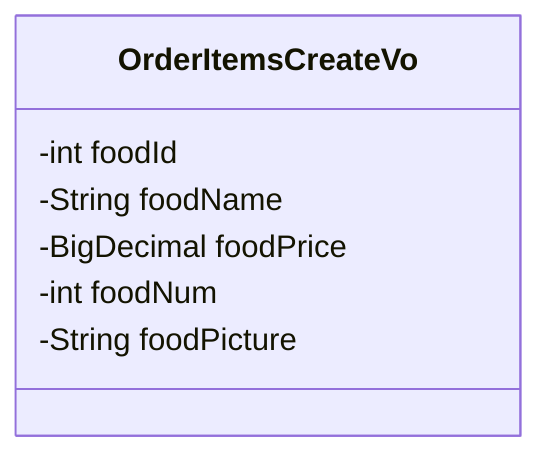
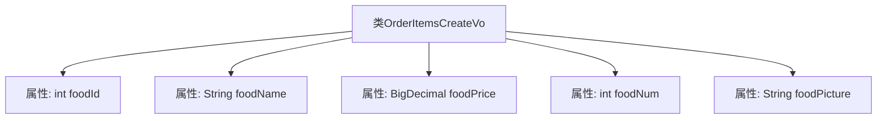

# 基础信息

|      |      |
|------|------|
| 编码语言 | .java |
| 代码路径 | boat-house-backend/src/product-service/api/src/main/java/com/idcf/boathouse/product/vo/OrderItemsCreateVo.java |
| 包名 | com.idcf.boathouse.product.vo |
| 依赖项 | ['lombok.Data', 'java.math.BigDecimal'] |
| 概述说明 | 订单项创建类含食物ID、名称、价格、数量和图片字段。 |

# 说明

订单项创建类是一个用于管理订单项的数据结构，主要包含五个关键字段：食物ID、名称、价格、数量和图片。食物ID用于唯一标识每种食物，名称描述食物的具体内容，价格表示食物的单价，数量记录该食物在订单中的购买数量，图片字段则用于展示食物的视觉信息。这些字段共同构成了订单项的基本信息，便于系统进行订单管理和展示。

# 类列表 Class Summary

| 名称   | 类型  | 说明 |
|-------|------|-------------|
| OrderItemsCreateVo | class | 订单项创建类包含食物ID、名称、价格、数量和图片字段。 |

## 类 OrderItemsCreateVo

|      |      |
|------|------|
| 访问范围 | @Data;public |
| 类型 | class |
| 名称 | OrderItemsCreateVo |
| 说明 | 订单项创建类包含食物ID、名称、价格、数量和图片字段。 |

### UML类图

**描述：**  
`OrderItemsCreateVo` 类用于表示订单项创建时的视图对象（VO），包含食品的唯一标识 `foodId`、食品名称 `foodName`、食品价格 `foodPrice`、食品数量 `foodNum` 以及食品图片 `foodPicture`。该类主要用于在创建订单项时传递数据，所有字段均为私有，通过 `@Data` 注解自动生成 getter 和 setter 方法。

### 内部方法调用关系图

这段代码定义了一个名为 `OrderItemsCreateVo` 的类，该类包含五个属性：`foodId`、`foodName`、`foodPrice`、`foodNum` 和 `foodPicture`。这些属性分别用于存储食物的ID、名称、价格、数量和图片信息。该类使用了 `@Data` 注解，自动生成了getter、setter、toString等方法，简化了代码的编写。

### 字段列表 Field List

| 名称  | 类型  | 说明 |
|-------|-------|------|
| foodName | String | 定义一个私有字符串变量foodName。 |
| foodPicture | String | 定义私有字符串变量foodPicture。 |
| foodNum | int | 私有整型变量foodNum。 |
| foodPrice | BigDecimal | 定义了一个私有的BigDecimal类型变量foodPrice。 |
| foodId | int | 定义私有整型变量foodId。 |

### 方法列表 Method List

| 名称  | 类型  | 说明 |
|-------|-------|------|

