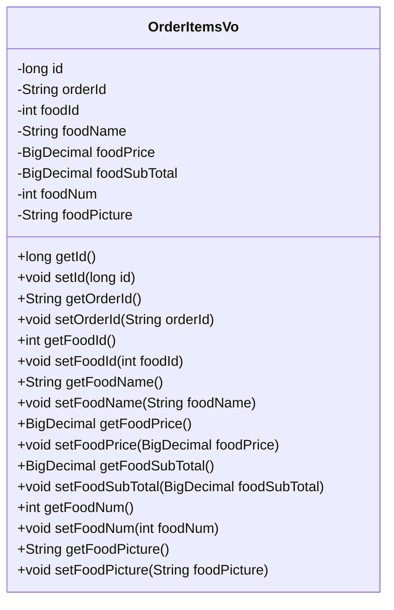
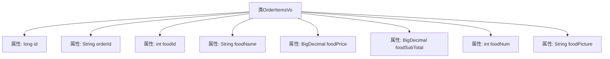

# 基础信息

|      |      |
|------|------|
| 编码语言 | .java |
| 代码路径 | boat-house-backend/src/product-service/api/src/main/java/com/idcf/boathouse/product/vo/OrderItemsVo.java |
| 包名 | com.idcf.boathouse.product.vo |
| 依赖项 | ['lombok.Data', 'java.math.BigDecimal'] |
| 概述说明 | OrderItemsVo类包含订单项ID、订单ID、食品ID、名称、价格、小计、数量和图片。 |

# 说明

OrderItemsVo类是一个用于表示订单项信息的类，包含了多个关键属性。这些属性包括订单项ID，用于唯一标识每个订单项；订单ID，用于关联所属的订单；食品ID，用于标识具体的食品；名称，表示食品的名称；价格，表示食品的单价；小计，表示该订单项的总金额；数量，表示该食品的订购数量；图片，用于展示食品的视觉信息。通过这些属性，OrderItemsVo类能够全面描述一个订单项的详细信息。

# 类列表 Class Summary

| 名称   | 类型  | 说明 |
|-------|------|-------------|
| OrderItemsVo | class | OrderItemsVo类包含订单项ID、订单ID、食品ID、名称、价格、小计、数量和图片。 |

## 类 OrderItemsVo

|      |      |
|------|------|
| 访问范围 | @Data;public |
| 类型 | class |
| 名称 | OrderItemsVo |
| 说明 | OrderItemsVo类包含订单项ID、订单ID、食品ID、名称、价格、小计、数量和图片。 |

### UML类图

**描述：**  
`OrderItemsVo` 类是一个用于表示订单项的数据模型，包含了订单项的基本信息，如订单ID、食品ID、食品名称、食品价格、食品小计、食品数量和食品图片等。该类通过私有字段存储这些信息，并提供了对应的公有getter和setter方法，以便外部访问和修改这些属性。

### 内部方法调用关系图

这段代码定义了一个名为`OrderItemsVo`的类，该类包含多个属性，用于表示订单项的相关信息。每个属性都有其特定的数据类型，如`long`、`String`、`int`和`BigDecimal`等。这些属性分别用于存储订单项的唯一标识符、订单ID、食品ID、食品名称、食品价格、食品小计、食品数量和食品图片等信息。该类的设计旨在封装订单项的数据，便于在系统中进行管理和操作。

### 字段列表 Field List

| 名称  | 类型  | 说明 |
|-------|-------|------|
| foodPicture | String | 私有字符串变量存储食物图片。 |
| foodName | String | 定义一个私有字符串变量foodName。 |
| foodId | int | 私有整型变量foodId |
| foodSubTotal | BigDecimal | 定义了一个私有的BigDecimal类型变量foodSubTotal。 |
| orderId | String | 订单ID字段声明。 |
| foodNum | int | 定义私有整型变量foodNum。 |
| foodPrice | BigDecimal | 定义了一个私有的BigDecimal类型变量foodPrice。 |
| id | long | 定义一个长整型私有变量id。 |

### 方法列表 Method List

| 名称  | 类型  | 说明 |
|-------|-------|------|

