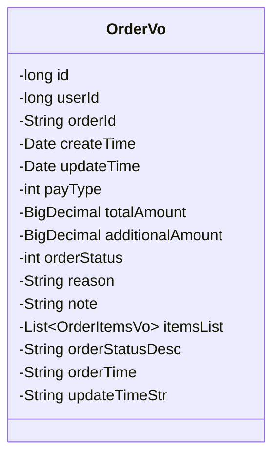

# 基础信息

|      |      |
|------|------|
| 编码语言 | .java |
| 代码路径 | boat-house-backend/src/product-service/api/src/main/java/com/idcf/boathouse/product/vo/OrderVo.java |
| 包名 | com.idcf.boathouse.product.vo |
| 依赖项 | ['lombok.Data', 'java.math.BigDecimal', 'java.util.Date', 'java.util.List'] |
| 概述说明 | 订单类包含ID、用户ID、订单ID、时间、支付类型、金额、状态、备注、商品列表等信息。 |

# 说明

订单类包含多个关键属性，用于描述订单的详细信息。这些属性包括订单的唯一标识符ID、关联的用户ID、订单ID、订单的创建时间和更新时间。支付类型指定了订单的支付方式，总金额和附加金额分别表示订单的总费用和额外费用。订单状态和状态描述提供了订单的当前状态信息，原因和备注字段用于记录订单的相关说明。商品列表包含了订单中的所有商品信息。订单时间和更新时间字符串分别以字符串形式记录了订单的创建和更新时间。这些属性共同构成了订单类的完整描述。

# 类列表 Class Summary

| 名称   | 类型  | 说明 |
|-------|------|-------------|
| OrderVo | class | 订单类包含ID、用户ID、订单ID、创建时间、更新时间、支付类型、总金额、附加金额、订单状态、原因、备注、商品列表、状态描述、订单时间、更新时间字符串。 |

## 类 OrderVo

|      |      |
|------|------|
| 访问范围 | @Data;public |
| 类型 | class |
| 名称 | OrderVo |
| 说明 | 订单类包含ID、用户ID、订单ID、创建时间、更新时间、支付类型、总金额、附加金额、订单状态、原因、备注、商品列表、状态描述、订单时间、更新时间字符串。 |

### UML类图

这段代码定义了一个名为 `OrderVo` 的类，用于表示订单的相关信息。类中包含多个私有字段，如订单ID、用户ID、订单状态、总金额等。此外，还包含了一些用于前端展示的字段，如订单状态描述、订单时间等。该类主要用于封装订单数据，便于在系统中进行传递和处理。

### 内部方法调用关系图

```mermaid
graph TD
    A["类OrderVo"]
    B["属性: long id"]
    C["属性: long userId"]
    D["属性: String orderId"]
    E["属性: Date createTime"]
    F["属性: Date updateTime"]
    G["属性: int payType"]
    H["属性: BigDecimal totalAmount"]
    I["属性: BigDecimal additionalAmount"]
    J["属性: int orderStatus"]
    K["属性: String reason"]
    L["属性: String note"]
    M["属性: List<OrderItemsVo> itemsList"]
    N["属性: String orderStatusDesc"]
    O["属性: String orderTime"]
    P["属性: String updateTimeStr"]

    A --> B
    A --> C
    A --> D
    A --> E
    A --> F
    A --> G
    A --> H
    A --> I
    A --> J
    A --> K
    A --> L
    A --> M
    A --> N
    A --> O
    A --> P
```

这段代码定义了一个名为 `OrderVo` 的类，用于表示订单的相关信息。类中包含多个属性，如订单ID、用户ID、订单状态、支付类型、总金额、附加金额等。此外，还包含了一些用于前端展示的属性，如订单状态描述、订单时间字符串等。这些属性共同构成了一个完整的订单数据模型，用于在系统中传递和处理订单信息。

### 字段列表 Field List

| 名称  | 类型  | 说明 |
|-------|-------|------|
| updateTimeStr | String | 定义私有字符串变量updateTimeStr。 |
| id | long | 定义一个长整型私有变量id。 |
| note | String | 定义了一个私有字符串变量note。 |
| additionalAmount | BigDecimal | 定义了一个BigDecimal类型的私有变量additionalAmount。 |
| payType | int | 支付类型为私有整型变量。 |
| updateTime | Date | 私有日期类型变量updateTime。 |
| totalAmount | BigDecimal | 定义一个用于存储总金额的BigDecimal类型变量。 |
| orderId | String | 订单ID为私有字符串类型。 |
| orderStatus | int | 私有整型变量orderStatus用于存储订单状态。 |
| orderTime | String | 私有字符串变量，用于存储订单时间。 |
| orderStatusDesc | String | 订单状态描述字段。 |
| itemsList | List<OrderItemsVo> | 私有订单项列表变量itemsList。 |
| reason | String | 定义私有字符串变量reason。 |
| userId | long | 定义了一个长整型的用户ID变量。 |
| createTime | Date | 定义私有日期类型变量createTime。 |

### 方法列表 Method List

| 名称  | 类型  | 说明 |
|-------|-------|------|

