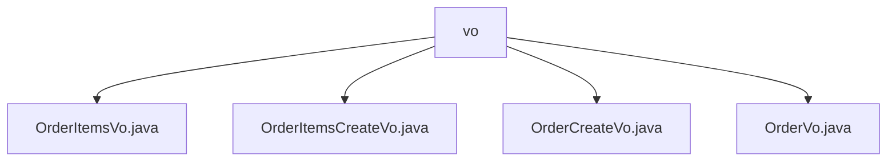

# 基础信息

|      |      |
|------|------|
| 编码语言 | .java |
| 代码路径 | boat-house-backend/src/product-service/api/src/main/java/com/idcf/boathouse/product/vo |
| 包名 | boat-house-backend.src.product-service.api.src.main.java.com.idcf.boathouse.product.vo |
| 概述说明 | 订单类及其相关类用于描述和管理订单信息，包括订单项、用户、支付、状态、时间等关键属性。 |

# 说明

OrderItemsVo类用于表示订单项信息，包含订单项ID、订单ID、食品ID、名称、价格、小计、数量和图片等属性，全面描述订单项。订单项创建类管理订单项数据，包含食物ID、名称、价格、数量和图片字段，便于订单管理和展示。订单创建类包含用户ID、用户名、附加金额、备注和订单项列表，确保订单完整性和可追溯性。订单类描述订单详细信息，包括订单ID、用户ID、订单ID、创建时间、更新时间、支付类型、总金额、附加金额、订单状态、状态描述、原因、备注、商品列表、订单时间和更新时间字符串等属性，构成订单类的完整描述。

### 包内部结构视图

该流程图展示了`vo`目录下的四个文件之间的层级关系。`vo`作为根节点，包含了四个子节点，分别是`OrderItemsVo.java`、`OrderItemsCreateVo.java`、`OrderCreateVo.java`和`OrderVo.java`。这些文件均位于`vo`目录下，表示它们属于同一个逻辑模块或功能组。

# 文件列表 File List

| 名称   | 类型  | 说明 |
|-------|------|-------------|
| [OrderVo.java](OrderVo.md) | file | 订单类包含ID、用户ID、订单ID、时间、支付类型、金额、状态、备注、商品列表等信息。 |
| [OrderCreateVo.java](OrderCreateVo.md) | file | 订单创建类含用户ID、用户名、附加金额、备注及订单项列表。 |
| [OrderItemsCreateVo.java](OrderItemsCreateVo.md) | file | 订单项创建类含食物ID、名称、价格、数量和图片字段。 |
| [OrderItemsVo.java](OrderItemsVo.md) | file | OrderItemsVo类包含订单项ID、订单ID、食品ID、名称、价格、小计、数量和图片。 |

